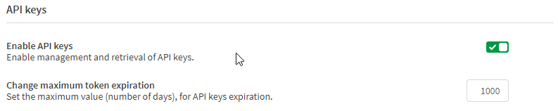

# API Keys
{:.no_toc}

## Summary
{:.no_toc}
API keys will be necessary if users want to leverage the Qlik Data Transfer utility to help move data up the cloud. Users will need to have the Developer role to generate an API key, and the tenant needs to have the option enabled.
It is also recommended to increase the API key expiration days so the API keys do not need to be regenerated too frequently.

