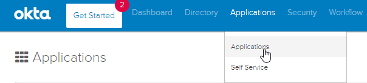

<!--#
LASTVERIFIEDDATE=11/01/2020
$-->

# Configuring Okta
{:.no_toc}
By default, tenants are set up using Qlik’s Identity Provider.  Tenant administrators can change the environment to leverage the organization’s own Identity Provider (e.g. Auth0, Okta, KeyCloak, etc.).  Ideally this should be done before users have been invited to the tenant and started to create apps, but changing IdPs after assets have been created is supported.
The benefit for using a 3rd party IdP is that user lists can be imported through an organization’s directory instead of inviting users to create a Qlik account.  In addition, as of {{LASTVERIFIEDDATE}}, only 3rd party IdPs allow group information to be brought into the Qlik SaaS environment which will be useful when assigning access to the various Spaces.

## Summary
{:.no_toc}
Okta provides a [developer edition](https://developer.okta.com/signup/) of their IdP that is free to set up and use that does not expire.  

### Set-up Okta Application
Once you have an Okta account, an application needs to be created to interact with Qlik Sense.

1. Navigate to the **Administration** console.  In the menu bar, click on **Applications**

  

