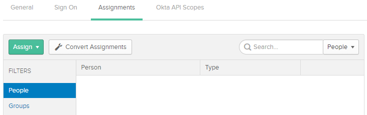
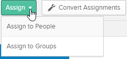
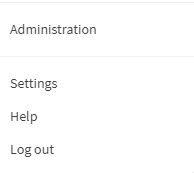
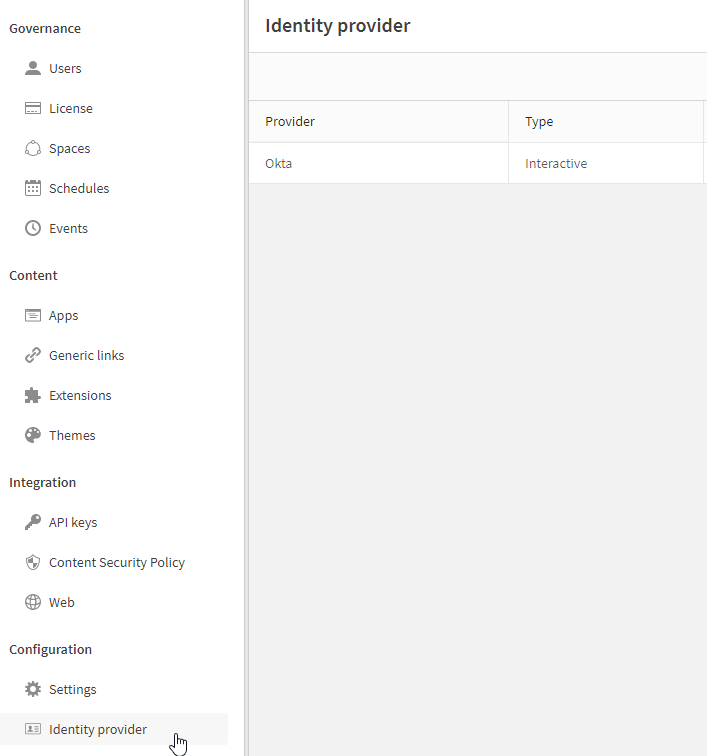
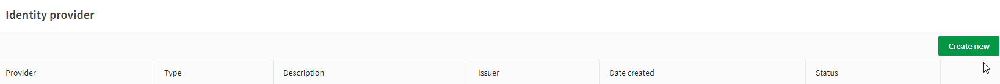
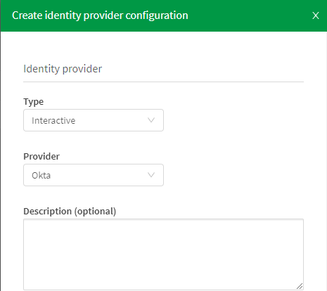
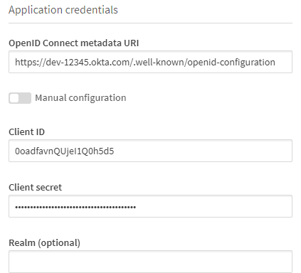
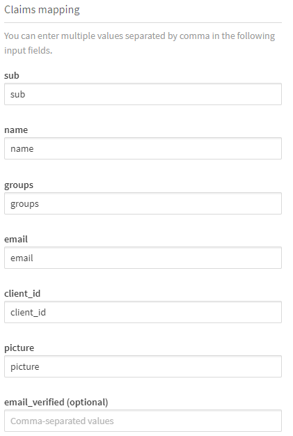

<!--#
LASTVERIFIEDDATE=11/01/2020
$-->

# Configuring Okta
{:.no_toc}
By default, tenants are set up using Qlik’s Identity Provider.  Tenant administrators can change the environment to leverage the organization’s own Identity Provider (e.g. Auth0, Okta, KeyCloak, etc.).  Ideally this should be done before users have been invited to the tenant and started to create apps, but changing IdPs after assets have been created is supported.
The benefit for using a 3rd party IdP is that user lists can be imported through an organization’s directory instead of inviting users to create a Qlik account.  In addition, as of {{LASTVERIFIEDDATE}}, only 3rd party IdPs allow group information to be brought into the Qlik SaaS environment which will be useful when assigning access to the various Spaces.

## Summary
{:.no_toc}
Okta provides a [developer edition](https://developer.okta.com/signup/) of their IdP that is free to set up and use that does not expire.  

### Set-up Okta Application
Once you have an Okta account, an application needs to be created to interact with Qlik Sense.

1.  Navigate to the **Administration** console.  In the menu bar, click on **Applications**

2.  Click on the button, **Add Application**\

3.	Click on the button, **Create New App**\

4.	Select the following:
    1. **Platform**: Web
    2. **Sign on method**: OpenID Connect
    

5.	Fill in the form with the following:
    1. **Application Name**: QCS
    2. **Login redirect URIs**: QCS tenant URL + /login/callback (e.g. *https://tinqcs.us.qlikcloud.com/login/callback*)
    

6.  Once the application is Saved, Client Credentials will be generated.  This will be used to enable a secure communication between Okta and the Qlik Sense SaaS tenant.  Copy these values into a text editor like **Notepad** for easy reference when configuring Qlik Sense

7.  Click on the **Sign On** tab if you want to retrieve Group information for users from Okta.  This can be done using string-based filter, or using [Okta expression language](https://developer.okta.com/docs/reference/okta-expression-language/).  In this example, we will bring in Groups that start with *Qlik*\
\
Refer to the Section, [Qlik Groups](../sample_data/groups.md), for detailed instructions on creating the groups that will be used to set up this environment

8.	Users need to be granted access to Okta apps.  We will need to grant users access to the Okta app that was just created.  Click on the **Assignments** tab
**Note**: *This step requires Users and/or Groups to be available in Okta. If they have not been created, skip this step for now, and come back once the Users and/or Groups have been created*

9.	Select the **Assign** drop-down to assign users or groups to the Okta application.  It is recommended to use Groups as it will be easier to maintain

10.	The minimum settings for Okta is now complete to integrate with your Qlik Sense SaaS tenant

### Integrating Okta with Qlik Sense SaaS
After the IDP has been configured, it needs to be integrated with Qlik Sense SaaS.  By default, the Qlik Sense SaaS is using Qlik IDP.  A new IDP needs to be created to point to the IDP that has been created

1.  Navigate to the **Administration** console for the Qlik Sense tenant\

2.	Navigate to the **Configuration>Identity Provider** section in the left-hand navigation pane

3.	Select **Create new** button

4.	Fill in the IDP form with the following:
    1.  **Type**: Interactive
    2.	**Provider**: Okta\
    

5.	Once the IDP is selected, the remainder of the form will expand.  Fill in the Application credentials section of the form with the following:
    1.	OpenID Connect metadata URI (this is the discovery endpoint of your Okta authorization server): https://[*Your Okta domain*]/.well-known/openid-configuration (e.g. https://dev-12345.okta.com/.well-known/openid-configuration)
    2.  Client ID: copied from Okta configuration into Notepad (e.g. 0oadfavnQUjeI1Q0h5d5)
    3.  Client secret: copied from Okta configuration into Notepad
    4.	Realm (optional): Okta 
    **Note**: *Can be meaningful to set when you run a Qlik multi-cloud environment and want to have consistent license usage across all Qlik Sense Sites.  Enter here the user directory attribute you have set in the SAML configuration for an Okta IDP on QSE on Windows*
    

6.	The next section of the form details the mapping of properties between the IDP and the Qlik user attributes.  For the most part, the default values can be kept.  Fill in the Claims mapping section of the form with the following:
    1.  **Sub**: preferred_username
    **Note**: *if kept as the default ‘sub’, this will be some cryptic value (e.g. 00ukyzk8yxsCuwhR99x).  Hence, changing it to ‘preferred_username’ will be more meaningful and may be required in setting up multi-cloud environments*
    2.	**Name**: name
    3.	**Groups**: groups
    4.	**Email**: email
    5.	**Client_id**: client_id
    6.	**Picture**: picture
    7.	**Email_verified (optional)**: [blank]
    **Note**: *Some of the information to be entered will be dependent on the IDP you are using. This example is for using Okta
    

