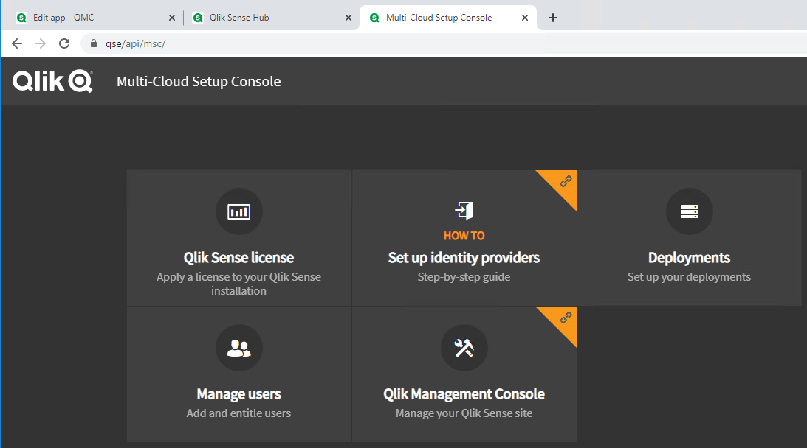

# Setting Up Hybrid Cloud
{:.no_toc}
Setting up a hybrid Qlik Sense architecture will allow users to leverage the capabilities of Qlik Sense while providing a cost-effective method for scaling out an analytics solution.  There are certain things to keep in mind though when distributing Qlik Sense apps from a client-managed environment into SaaS:
- Apps distributed to the cloud are read-only.  Users cannot make any changes in the Cloud hub, such as creating private or community sheets or stories in the app.  To work directly on the app in the Cloud hub, a user with the right privilege will need to export the app and then re-import it into the Cloud hub
- On-Demand apps are not supported
- Extensions are not supported for distributed apps.  Visualizations using extensions may not open in the Cloud hub properly as an error will appear indicating the visualization is not found

## Configuring Qlik Sense Client-Managed for Cloud Distribution
Before beginning, it is important to check that the Qlik Sense Enterprise on Windows license is using the **Signed License Key**.  In addition, the license should be the same as the SaaS tenant to leverage the same user licenses

1.  Enable the Qlik Sense Enterprise Client-Managed for Cloud distribution.  Navigate to the **Multi-Cloud Setup Console** by clicking on the **Cloud distribution** link in the QMC under **Configure System**\
 \
**Note**: *For Qlik Sense version prior to November 2020 or if you had configured multi-cloud deployment previously, you will need to navigate to the URL **https://[host name]/api/msc/***

2.	Set up a new SaaS deployment
    1.  For Qlik Sense versions November 2020 and onwards, click on **Deployment setup** and then click on the link to navigate to **Multi-cloud setup console**
    
    2.  For Qlik Sense versions prior to November 2020, Click on **Deployments**\
    

3.	On the bottom-left corner click on **Set up new**\

4.	Fill in the form with the following:
    1.  **Deployment name**: qcs
    2.	**API endpoint**: [*SaaS tenant URL*] (e.g. https://mytenant.us.qlikcloud.com/)
    3.	**Audience**: qlik.api
    4.	Select the checkbox for **Use local bearer token**

5.	Click on **Copy to clipboard** to save the *Qlik Cloud Services format* token to be used in configuring your SaaS tenant

6.	Click on **Apply** to save the configuration

## Configuring Qlik Sense SaaS
1.	Navigate to the **Administration** console in your Qlik Sense SaaS tenant\

2.	Navigate to the **Configuration>Identity Provider** section in the left navigation panel to add a multi-cloud IDP

3.	Click **Create New** on the right
