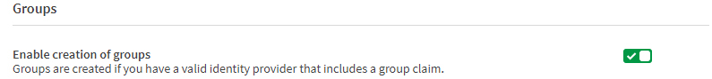

<!--#
LASTVERIFIEDDATE=11/01/2020
$-->

# Groups
{:.no_toc}

## Summary
{:.no_toc}
If you want to leverage the concept of groups, as of {{LASTVERIFIEDDATE}}, a 3rd party Identity Provider will need to be configured.  In addition, the option needs to be enabled
