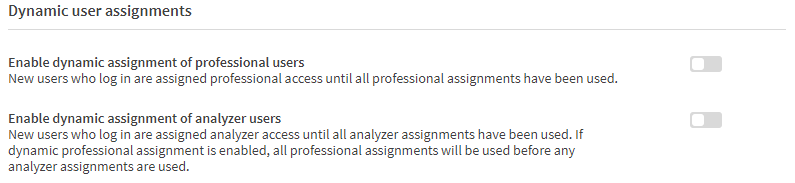

# License Allocations
{:.no_toc}

## Summary
{:.no_toc}
The initial set up of the Qlik Sense Tenant does not allocate users licenses, therefore they can log in to the environment, but will not be able to perform any actions.  There is the option to automatically allocate Professional and Analyzer license.

Note that there is an option for both Professional and Analyzer.  If both are enabled, Professional licenses will be allocated to new users on a first-come-first-serve basis, and then new users will be assigned Analyzer licenses once all the Professional allocations have been consumed.  

This is also important in instances where there are Analyzer Capacity packs available.  If the dynamic assignments are disabled for both Professional and Analyzer, and the tenant has Analyzer Capacity, new users interacting with the environment will consume the Analyzer Capacity minutes.
